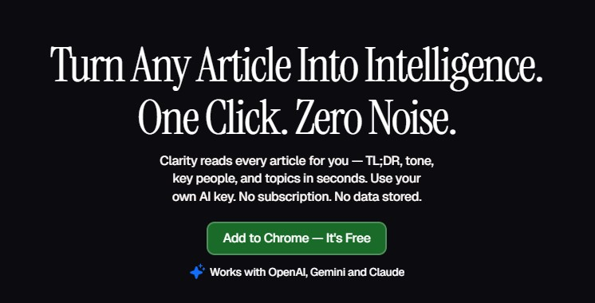
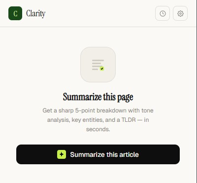
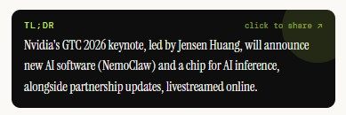

# Clarity — AI Reading Assistant for Chrome

> Turn any article into intelligence. One click. Zero noise.



**[🌐 Website](https://clariity.framer.ai)** · **[Install Guide ↓](#install-in-60-seconds)**

---


---

## Install in 60 seconds

No Web Store. No $5 fee. Load it directly into Chrome.

**1. Clone or download this repo**
```bash
git clone https://github.com/dhruvil-codes/clarity-extension.git
```
Or click **Code → Download ZIP** and unzip it.

**2. Open Chrome Extensions**
Go to `chrome://extensions`

**3. Enable Developer Mode**
Toggle it on in the top-right corner.

**4. Load the extension**
Click **Load unpacked** → select the `clarity-extension` folder.

**5. Add your API key**
Click the Clarity icon → ⚙ Settings → choose your provider → paste key → Save.

---

## Supported AI Providers

| Provider | Recommended Model | Get API Key |
|---|---|---|
| OpenAI | GPT-4o Mini | [platform.openai.com](https://platform.openai.com) |
| Anthropic | Claude Haiku | [console.anthropic.com](https://console.anthropic.com) |
| Google | Gemini 2.5 Flash | [aistudio.google.com](https://aistudio.google.com) |

> GPT-4o Mini costs ~$0.0003 per summary. $5 lasts years at casual use.

---

## What you get



- **TL;DR** — one sharp sentence capturing the full argument
- **5 Key Takeaways** — clean numbered breakdown
- **Tone Analysis** — e.g. Informative · 91%, Critical · 78%
- **Key People & Companies** — click any entity to Google them
- **Ask Follow-ups** — ask anything about the article
- **Share Card** — generate a beautiful image, copy to clipboard, paste into X
- **History** — last 15 summaries saved locally, viewable in the popup



---

## Privacy

Your API key is stored locally on your device via `chrome.storage.sync`.
Article text goes directly from your browser to your chosen AI provider.
**Clarity never sees your data.**

---

## Built with

Chrome Manifest V3 · Vanilla JS · HTML5 Canvas · No frameworks · No tracking

---

## Contributing

PRs welcome. Open an issue first for big changes.

---

Built by [@bydhruvil](https://x.com/bydhruvil) · [clariity.framer.ai](https://clariity.framer.ai)